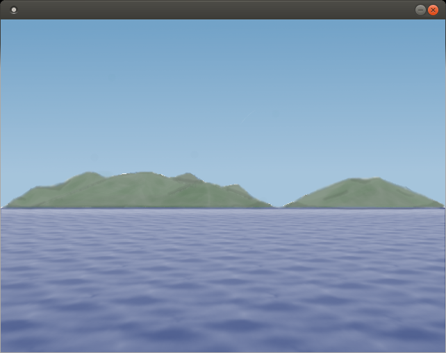
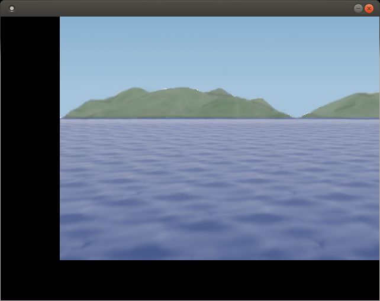

% 第2回:画像を表示する
% Glowlight
% 2018.03.14

ゲーム開発の基本. 画像を表示する方法を学ぼう. 画像の表示はどんなゲームでも行われているとても基本的なことなので是非これを出来るようになろう! あ, CUIのゲームも存在するか. まぁいいや.

## 方針

- 画像を表示できるようになる.

## ソースコード

Main.java: 以前とおなじ

~~~java
public class Main{
	static public void main(String str[]){
		GameMain test = new GameMain();	
	}
}
~~~

GameMain.java: 以前とおなじ

~~~java
import java.awt.*;
import java.awt.event.*;
import javax.swing.*;
import javax.swing.event.*;

import java.io.*;

public class GameMain extends JFrame{
	private GameSequence sequence;

	public GameMain(){
		
		setDefaultCloseOperation(JFrame.EXIT_ON_CLOSE);
		setLocationRelativeTo(null);

		sequence = new GameSequence();
		add(sequence);

		pack();
		setResizable(false);
		setVisible(true);
	}

	public static void main(String str[]){
		new GameMain();		
	}
}
~~~

GameSequence.java: シーケンス(紙芝居の1シーン)のクラス ブラウザのタブみたいなもの

~~~java
import java.awt.*;
import java.awt.event.*;
import javax.swing.*;
import javax.swing.event.*;

import java.io.*;
import java.util.ArrayList;

//GameSystem
public class GameSequence extends JPanel{
	GameImage pic;

	public GameSequence(){
		setPreferredSize(new Dimension(640, 480));
		setBackground(Color.BLACK);

		pic = new GameImage("bgp.png");
	}
	
	public void paintComponent(Graphics g){
		super.paintComponent(g);
		Graphics2D g2d = (Graphics2D)g;
		
		g2d.drawImage(pic.getImg(), 100, -100, this);

		Toolkit.getDefaultToolkit().sync();
		g.dispose();
	}
}
~~~

GameImage.java: 画像を扱うためのクラス.

~~~java
import java.awt.*;
import javax.swing.*;
import javax.imageio.*;
import java.awt.image.*;
import java.io.*;
import java.awt.geom.*;

//GameWrap
public class GameImage{
	protected BufferedImage img;
	protected int width;
	protected int height;

	public GameImage(String pic){
		try{
			if(pic != null){
				img = ImageIO.read(new File(pic));
			}

			width = img.getWidth();
			height = img.getHeight();
		}catch(IOException e){
			System.out.println(e);
		}
	}

	public BufferedImage getImg(){
		return img;
	}
	
	public int getWidth(){
		return width;
	}

	public int getHeight(){
		return height;
	}
}
~~~

## 解説

Main.javaとGameMain.javaは前回と同じなので説明を省く. 今回新しく追加されたのはGameImage.javaというクラスだ. これは単にjava標準ライブラリの画像を扱うクラス, BufferedImageを継承したものに過ぎない. ただ単にコンストラクタ

~~~java
public GameImage(String pic)
~~~

を追加してファイルパスから読み込めるようにしただけである. 毎回この処理をす
るのが面倒なので自動で出来るようにコンストラクタに組み込んだだけである.
ではどうやって読み込んだ画像を表示すればいいのだろうか.

ここでGameSequence.javaの出番となる. GameSequnece.javaコンストラクタにてGameImage型のインスタンスを生成している. その画像を表示するときは

~~~java
public void paintComponet(Graphics g)
~~~

というメソッドで特定の処理を行うと良い. ここでもよくわからない行があると思うが大部分をおまじないと思ってくれても良い. 注目すべきは

~~~java
g2d.drawImage(pic.getImg(), 0, 0, this);
~~~

という部分だ. これはpic.getImg()で読み込んだ画像をthisつまりGameSequenceに座標(0,0)で表示されるという処理である. 実行結果は次のようになる.

 

ここで, 第2,3引数を変更すると画像を平行移動することが出来る.

~~~java
g2d.drawImage(pic.getImg(), 100, -100, this)
~~~

とすれば, 画像を座標(100,-100)を原点として表示することが出来る.

この処理は非常に大事である. これはキャラクターを移動するときに使う手法なのである.

javaの標準ライブラリでは画像を回転させたり, 直線や点そして長方形を描画することができるがそれはいずれ取り上げる予定だ. 今回はここまで. 次回は画像をチップに分割してそれらを表示することを扱う.
