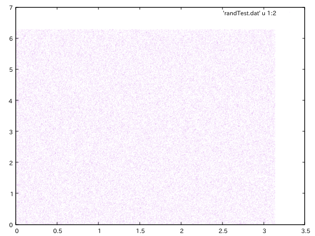
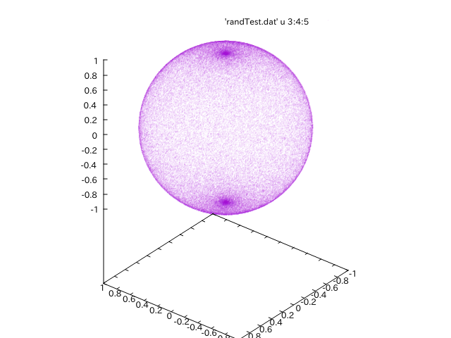
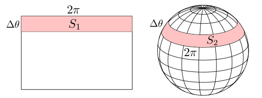

% 惑星を生成する その3 - 球面上の一様乱数
% Glowlight
% 2018.03.16

第2回の記事で, 球面で一様乱数をつかって球面を分割するという話になった. 球面で一様に分布する点を生成するときに実は少し工夫しないと上手くいかない. このことを実際に見ていこう.

## 球面上の乱数

球面上の緯度と経度をそれぞれ$\theta, \phi$とおいて指定の位置に点を置くことを考えよう. ここでそのまま2つの変数を

$$ \theta \in [0, \pi], \phi \in [0, 2\pi]$$

の範囲の一様乱数とみなすとどうなるかを実験してみよう.

### 一様乱数をそのまま使った球面の点

実験のために使ったpythonコードは次のようである.

**randomTest.py**

~~~python
import random
import math

for n in range(1, 100000):

    #緯度と経度を一様乱数で生成
    th = random.uniform(0,math.pi)
    ph = random.uniform(0,2*math.pi)

    #3次元球面に変換
    x = math.sin(th)*math.cos(ph)
    y = math.sin(th)*math.sin(ph)
    z = math.cos(th)

    print(str(th) + ' ' + str(ph) + ' ' + str(x) + ' ' + str(y) + ' ' + str(z))
~~~

このコードでは緯度経度の情報を, 極座標と直交座標の関係

$$ x = \sin \theta \cos \phi , \\ y = \sin \theta \sin \phi , \\ z = \cos \theta $$

を用いて3次元球面の座標に変換している. このコードで球面上の点を100000個生成してそれをGnuplotで表示した結果がこちらである.

**図1**は点の座標を2次元平面(緯度, 経度)で表したものでちゃんと均等に点が分布している. しかし**図2**は点の座標を3次元球面にプロットしたものであるが, このとおり**南極と北極の部分に点が密集してしまう**のである.

だからこの方法ではGCFで必要な均等な分割が実現できないのである. (逆に言えば不均一な点の分布を使えば面白い地形を上手く作れるかも知れない.)

## なぜ極値に密集するのか

結論を言うと, **極地で点の密度が高くなるから**. 緯度と経度は一様分布から生成してはいけない. 極地で点の密度増加が上手く打ち消されるように分布を工夫する必要がある.

### 近似的な説明

 

緯度$\theta$と経度$\phi$による2次元平面$(\theta, \phi)$の中に点がN個ランダムに分布していると考える. このとき, 2次元平面の$[\theta, 0]\times[\theta + \Delta \theta, 2 \pi]$という領域を考えるとその面積$S_1$は

$$S_1 = 2\pi \Delta \theta$$

であることがわかる. また確率分布は$f(\theta, \phi) = (\frac{1}{2 \pi})(\frac{1}{\pi})$なのでその領域に含まれる点の数は

$$NS_1 f(\theta, \phi) = N(\frac{\Delta \theta}{\pi})$$

次に, 3次元球面について, 緯度$\theta$から $\theta + \Delta \theta$の間の面積$S_2$は近似的に

$$S_2 = 2 \pi \sin \theta \cdot \Delta \theta$$

である. その領域と前節の領域に含まれる点の数は等しいはずだから, このことを利用して球のその領域に含まれる点の密度は

$$\frac{NS_1 f(\theta, \phi)}{S_2} = \frac{N}{2 \pi ^2 \sin \theta}$$

となる. だからsinの値が小さくなる極地では点の密度が大きくなることがわかる. そもそも**球面上**で一様に点が分布して欲しかったのにこれじゃあ駄目なのである. 全然一様じゃない.

### どんな分布関数にすればいいのか

前項の点の密度を表す式を見ると分母に三角関数が現れるために球面に点が均一に分布しないことがわかる. だから平面での分布関数を上手く設定して分母の三角関数を打ち消せばよい. ここで改めて分布関数を設定しなおす. 規格化因子を$A$として

$$f(\theta, \phi) = (\frac{1}{2 \pi})(A \sin \theta)$$

と設定する. 一つ目の括弧が$\phi$に対応していて, 2つ目が$\theta$に対応している. 規格化条件から$A= 1/2$がすぐわかる. この分布関数を用いると, 球面の部分領域に含まれる点の密度は

$$\frac{NS_1 f(\theta, \phi)}{S_2} = \frac{N}{4 \pi}$$

となってちゃんと均一に分布するようになる. 以上より用いるべき分布関数は次の分布である.

$$f(\theta, \phi) = (\frac{1}{2 \pi})(\frac{\sin \theta}{2})$$

## ではどうすればよいのか

ついに用いるべき分布関数がわかった. しかしまだまだ問題はある. この分布に従う乱数をどうやって生成すればいいのかという問題である. ちなみに$\phi$については$\phi \in [0, 2\pi]$を満たす一様乱数のままで良い.

言い換えれば

一様乱数 $r \in [0, 1]$ を用いて $f(\theta) = \frac{\sin \theta}{2}$という分布をもつ乱数を生成せよ.

ということである. これについては次回述べる.