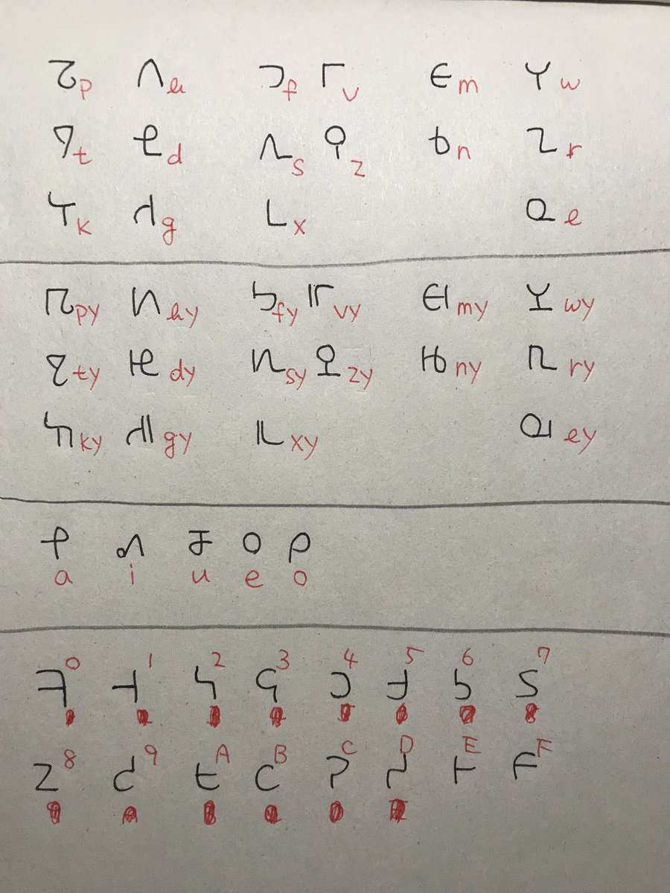

% 人工言語作成 進捗報告2 現在どこまでできているか
% Glowlight
% 2018.05.25

## どこまでできているか

私が自分のサイトに人工言語の進捗を発表するのは今日が初めてである. これより1年ぐらい前から人工言語作成には取り組んでいるために, 残念ながら進捗報告は実況形式というかリアルタイムですることは不可能になっている. だからとりあえず今はどこまで人工言語が出来上がっているのかを報告しようと思う. これ以降はちゃんと実況形式になる予定である.

あ. いい忘れていた. 私が今作っている人工言語の名前は「**ヴォルチェゼーネ** volTezene」. 大文字は口蓋化した子音を表す.

~~~
volTe: テクノロジーのエポック
zene: 言語
~~~

が由来である. ここでの「テクノロジーのエポック」というのはもちろん我々シンギュラリタリアンの敬愛する同志カールワイルの著書「The Singularity is near」に出てくるエポックのことである. 詳しくは[wikipediaの「技術的特異点」](https://ja.wikipedia.org/wiki/%E6%8A%80%E8%A1%93%E7%9A%84%E7%89%B9%E7%95%B0%E7%82%B9#%E9%80%B2%E5%8C%96%E3%81%AE6%E3%81%A4%E3%81%AE%E3%82%A8%E3%83%9D%E3%83%83%E3%82%AF)の記事を参照.

## 進捗

### やったこと

- 文字の作成
- 音韻の割り当て
- 数字の作成
- 名詞および形容詞の格変化
- 時制と相の設定
- 疑問文の書き方
- 代名詞
- 語彙自動生成ソフト開発

文字については初期の頃はヴォイニッチ手稿のものをいくつか拝借していた. でもやっぱり自分オリジナルなものを使いたくなったので全部をオリジナルなものにした. この言語の子音にはロシア語や日本語のように**口蓋化したものとそうでないものの区別**がある. 

 

数字の方はこんな感じである. 4で割った時の商と余剰で分類がなされているので比較的覚えやすくなっている. 途中で忘れてもルールさえ覚えていれば判別や書くこともたやすくできる.

名詞・形容詞の格は12個ある. 前置詞を排除したかったからこんなに増えた.

疑問文・時制と相・代名詞などに関することは次回に書くことにする.

### 今取り組んでいること

- 単語の作成
- webドキュメントの作成

単語は重要. 文法を定めることよりも重要かも知れない. 私は文法から作り始める派であった. でも例文を書こうと思っても語彙が少なすぎて何も書けなかった. こうならないためにも単語はちゃんと多めに作っておくべき.

でもさ, 単語を作ろうと思ってもどんな単語があるんだっけ? 漏れは無いかな? って不安になってしまうよね. なにかいろんな言語の基本語彙を集めたものがあれば助かるのだが検索してもなかなかいいのが出てこない. そんなときたまたま店で見かけて買った「明解言語学辞典」に「スワデシュリスト」という言葉を見つけた. ちょうど私が求めていたものであった. さらには英語のサイトで[Buck List](http://cals.conlang.org/word/list/) というスワデシュのよりも多い基本語彙集が見つかった. なんと約2000語収録という. ただし英語話者向けのものなので注意が必要.

今はこのBuck ListのCSVファイルを基にして単語作成をしている. ちゃんと分野IDが単語に振られているから大変役に立っている.