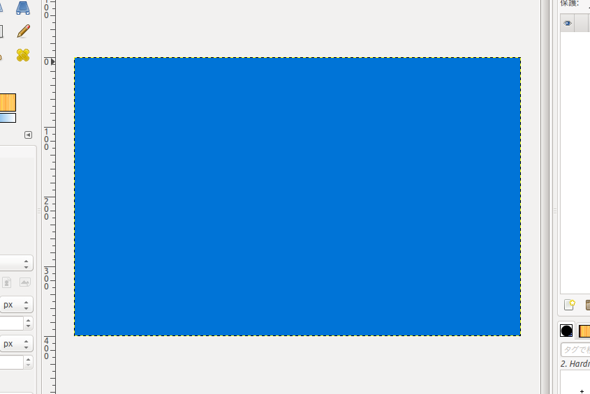
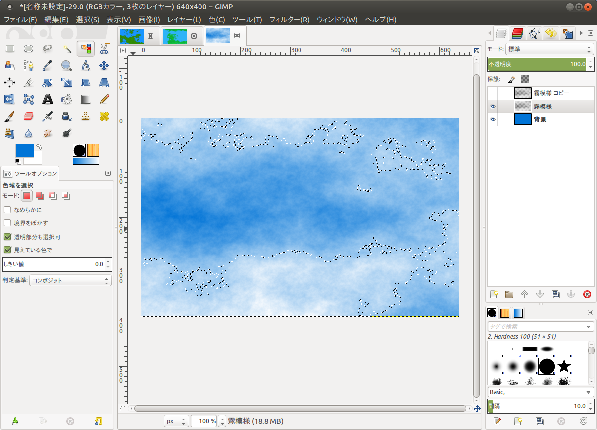
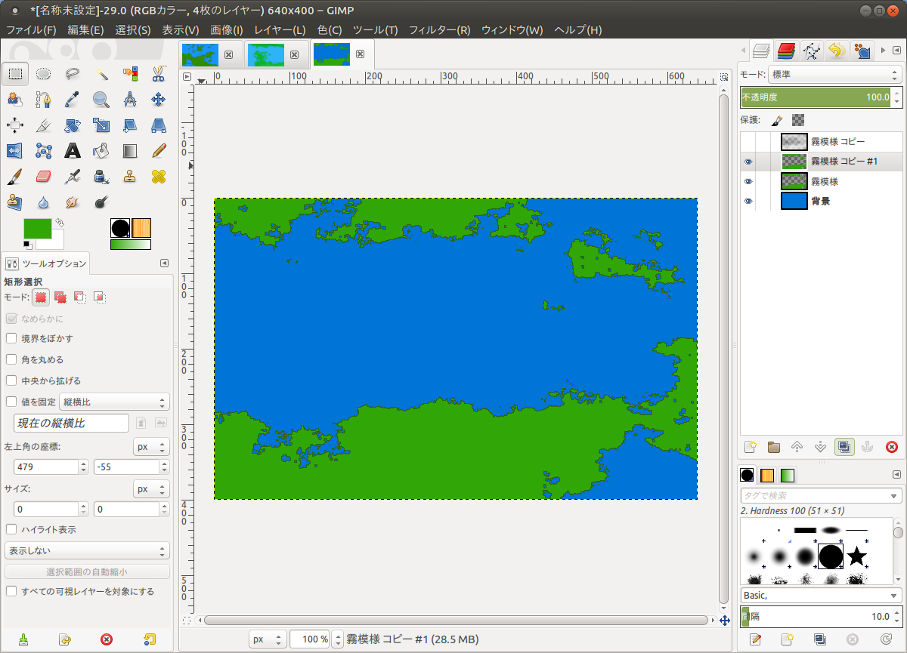
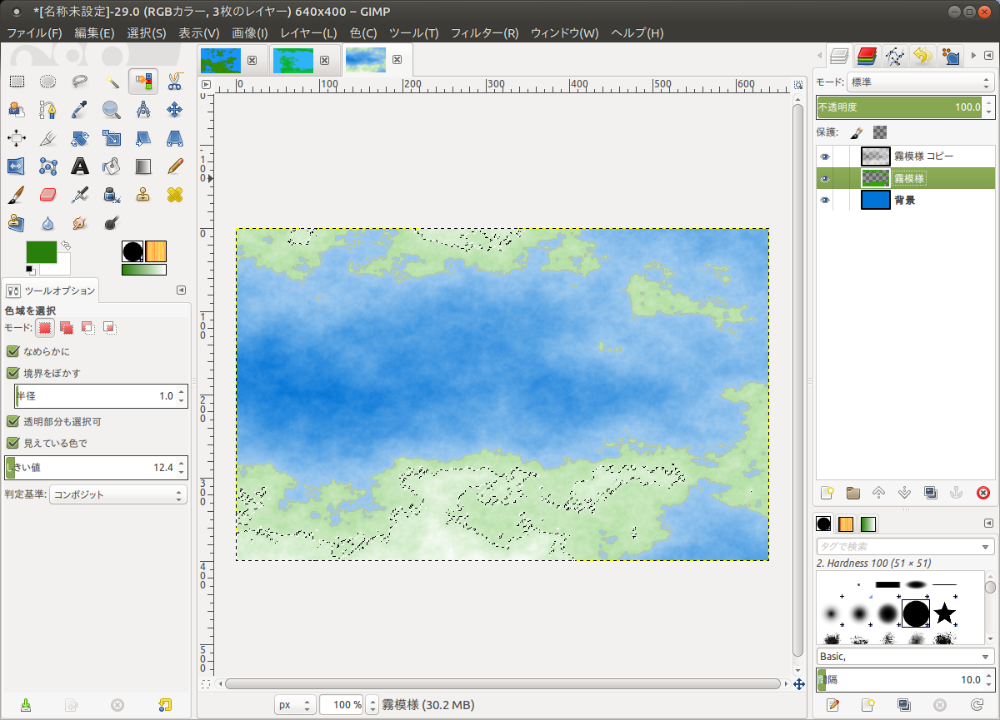
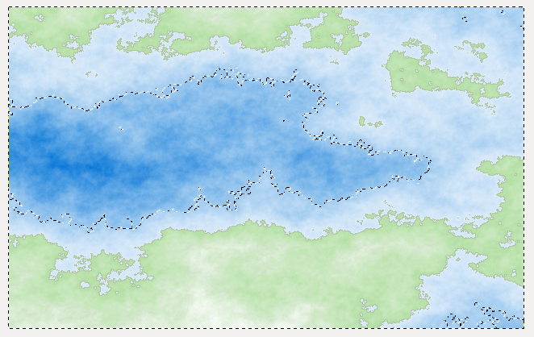
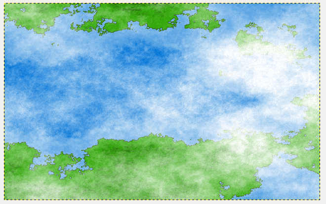
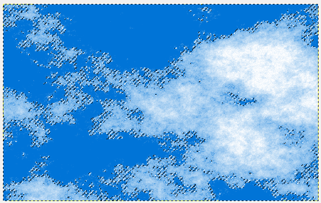
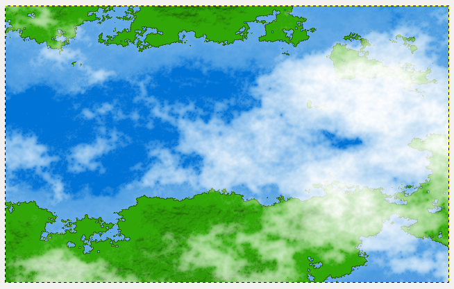

% Gimpで地形生成をしよう! その1
% Glowlight
% 2018.03.14

木曜日, 08. 3月 2018 07:59 午後 

私が絵を描くときによく使っているのはGimpである. ロゴのようななめならかでシンプルな図形を描くときはInkscapeを使っている. どちらもLinuxでも動くオープンソースなソフトウェアだ.

自動で地形生成をするときは大抵の場合, プログラミングをすることが必要になる. それができるひとならあまり問題は無いかもしれないが, 苦手な人にとっては敷居が高くなるし, プログラムを書くこと自体が多くの人にとっては面倒なことだろう. それに地形生成のようなプログラムは数学や物理学の知識が必要になることが多いのでそれらが苦手な人にとってはなかなか手を出しにくい.

だから, Gimpのような既存のソフトを使って自然科学の知識があまり無くても誰でも簡単にそれなりの地形を作ることができるようになるのは, 全人類にとっての大きな進歩となる. 誰でも簡単に何かを出来るようになる. これがテクノロジーの, 文明の進歩なのである.

では早速Gimpで地形を生成していこう!

##必要な機能

今回使うGimpの機能のメインはフィルターと領域選択である. 使う機能をリストにまとめると以下のようになる. 書き始める前にどこにその機能があるのかを確認しておこう.

**フィルター**

1. 霧 : *フィルター > 下塗り > 雲 > 霧*
2. バンプマップ: *フィルター > バンプマップ*

**ツールボックス**

1. ブラシで描画: 筆アイコン
2. 消しゴム
3. 色域を洗濯: 信号機みたいなアイコン
4. ぼかし/シャープ: 水滴アイコン

**領域選択**

1. 領域を反転
2. 領域を縮小 or 領域を拡大

##陸地の生成

###標高データとなる霧画像の作成

まず手始めに青く塗った背景画像を用意しよう.

この次はフィルターで**霧**を作成する. 設定は

- 霧の深さ: 1.0
- 不透明度: 100

を使う. この次に**ぼかし/シャープ**ツールを使って霧全体をぼかす. この作業をすることによって大陸の形が細か過ぎて粉っぽくなるのを防いでくれるのである.

生成してぼやかした**霧画像はレイヤーのコピーを使って保存しておくこと.**この霧画像が地形の標高データとなっているので, 山地を作ったり, 浅瀬の海底を作ったりに使えるのである.

###大陸の生成

その次は**色域選択ツール**を使って**白いところ**をクリックする. そしてそのまま左右にドラッグすると閾値の数値を細かく上下することが出来る.
このとき色域選択ツールの設定で**なめらかに**と**境界をぼかす**を外すこと. 設定は下の画像参照.

その後は選択領域を緑系の色で塗って大陸を描き, **選択範囲を反転**した後に消しゴムで霧を消して海を描く. 次に同じようにまた**反転**して
今度は**選択領域を縮小する(設定は1px)**を実行して少し明るめの緑で大陸を塗る.

これらの作業をすることでなかなか本格的な大陸を作ることが出来るのだ.

###山の生成

次は山にする部分の領域を選択するために, 以前保存しておいた霧のコピーを使う. 霧を色域選択ツールを使って大陸よりも少し狭い領域を選択しよう. こうすることによって海岸沿いに平野を作ることが出来る.

その後は, 編集対象のレイヤーを大陸の方に戻してからフィルターの**バンプマップ**を選択しよう. バンプマップ機能を使うとあるレイヤーに別のレイヤーの画像を写像することができる. 細かい設定は画像参照.

そして, 一旦霧のレイヤーを不可視にして**選択領域をそのまま維持**しながら少し濃い緑で選択領域を塗る.

これで大陸の部分は完成となる.

##海の生成

これでやっと大陸が描けたわけだから, 次は大陸周辺の浅瀬を描いてみよう. 例によって霧レイヤーを色域選択ツールで大陸よりも広い領域を選択する.

そのあとは, 領域反転を使って水深が深いところを消しゴムで消し, 浅瀬は
透明な青色で何回か塗りつぶして描く.

これで地形自体は完成となる. ここで雲も描きたいなーと思ったら次に進もう.

##雲の生成

これはフィルターの霧ツールで作ることが出来る. ただしこのときは**霧の震度を2.0**にしよう.

また色域選択ツールを使ってちょうどいい感じに雲を作る.

そのあとは雲を**ぼかしツール**でなぞって完成となる.

**これが完成系の地形!!!**
