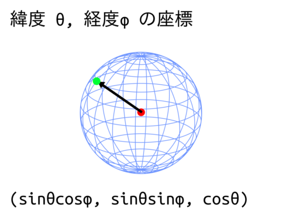
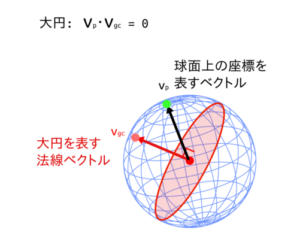

% 惑星を生成する その2 - Great Circle Faulting の実装
% Glowlight
% 2018.03.14

前回の記事でGreat Circle Faulting(GCF)の基本的なアルゴリズムを紹介した. 今回はそのアルゴリズムを実装する方法を紹介していく. 必要なことは3つあり,

1. 球を2つに分割すること
2. それを何回も繰り返すこと
3. 標高を得ること

である.

## 球面の分割法 ベクトルの内積を使う

球面上の座標はベクトルを用いて表すことができる.

 

球面の緯度 $\theta$, 経度 $\phi$が与えられたときに極座標と直交座標の変換公式を使えば, 図のようにその座標をベクトルで表すことが出来る. 北極なら$(0,0,1)$というベクトルで, 南極なら$(0.0.-1)$というベクトルで表される.

  

大円も法線ベクトルで表すことが出来る. ランダムに法線ベクトルを球面上に設置すればそれだけで大円を置いたことになる. その法線ベクトルと他のベクトルの内積をとり, 内積が正のとき標高を$+1$上げる, 負のとき標高を$-1$下げる. とするのである.

## 標高を求める関数

複数回分割するときも同様にすればよくて, 球面座標を$\boldsymbol{x}$, $i$番目の大円の法線ベクトルを$\boldsymbol{a}_i$とする. このときの標高は

> 大円の法線ベクトルと座様の内積 × 標高の変化

の総和を取ったものとなる. 数式で表すと, 

$$f(\boldsymbol{x}) = \sum ^n _{k=1} sgn( \boldsymbol{x} \cdot \boldsymbol{a}_k)$$

となる.

## 標高の平均と標準偏差

法線ベクトルの向きは球面に対してランダムである. つまり球はランダムな方向にn回だけ2分割されることになる. ここである位置でそこが隆起するか沈降するかはどちらも$\frac{1}{2}$の確率で決まることがわかる. 各分割処理は独立しているのである球面座標$\boldsymbol{x}$での標高は

$$<h(\boldsymbol{x})> = \sum ^n _{k=1} <sgn( \boldsymbol{x} \cdot \boldsymbol{a}_k)> =0$$

である. 球面の平均標高は0である. つぎに標高の標準偏差を考えよう. そのためにはまずは標高の分散 $\sigma^2 (\boldsymbol{x})$を求めよう. 平均標高が0なので,

$$\sigma (\boldsymbol{x}) = <(\sum ^n_{k=1} sgn( \boldsymbol{x} \cdot \boldsymbol{a}_k)) \times (\sum ^n_{k=1} sgn( \boldsymbol{x} \cdot \boldsymbol{a}_j))> $$

$$= \sum ^n_{k \neq j} <sgn( \boldsymbol{x} \cdot \boldsymbol{a}_k)) \cdot sgn( \boldsymbol{x} \cdot \boldsymbol{a}_j)> + \sum ^n_{k=1} 1 $$

$$= \sum ^n_{k \neq j} <sgn( \boldsymbol{x} \cdot \boldsymbol{a}_k))>
<sgn( \boldsymbol{x} \cdot \boldsymbol{a}_j)> + n $$

$$= n $$

なお, 2行目の右辺第二項では符号関数の2乗は1になることを利用し, 3行目の右辺第1項では各分割が独立であることを利用した. なのでこの結果から標高の標準偏差は$\sqrt{n}$であることがわかった.

まとめると, ある位置での平均標高と標高の標準偏差は

- 平均: 0
- 標準偏差: $\sqrt{n}$

となる.

## おわりに

今回はGCFの実装方法について紹介した. 球の大円を用いた分割法, ベクトルを用いた座標・大円の表現, 標高を得る関数, といったものを紹介した.

で, ベクトルを用いた大円の表現のところで, 法線ベクトルをランダムに生成すればよいと書いていたが, 実はここに注意が必要である. 緯度th・経度phをそのまま一様乱数を用いて生成すると座標が極値に偏ってしまうのである. 次回はこの点について取り上げる.
