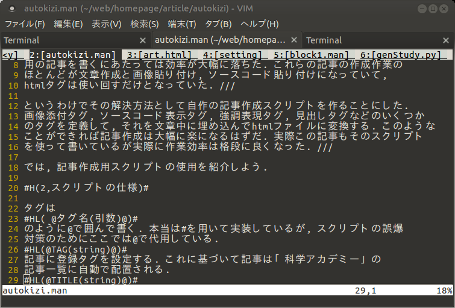
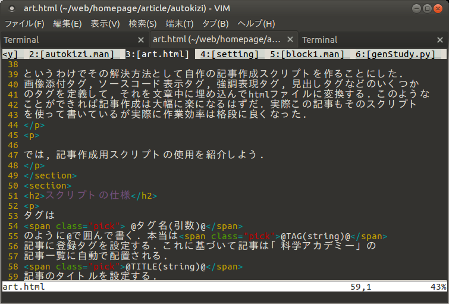

% 共和国の自動化 その1. 記事作成スクリプト
% Glowlight
% 2018.03.14

このサイト, ぐろーらいと人民共和国は長い間, html手打ちで作られてきた.最初のうちはそれでも良かったが, 次第に面倒くさくなってきた. サイト建設初期の場合はhtmlのタグを打ち込むことが大部分を占めていたので手打ちでも十分に効率的に作業することができた. しかし,  「科学アカデミー」用の記事を書くにあたっては効率が大幅に落ちた. これらの記事の作成作業のほとんどが文章作成と画像貼り付け, ソースコード貼り付けになっていて, htmlタグは使い回すだけとなっていた.

というわけでその解決方法として#B(自作の記事作成スクリプトを作ることにした. 画像添付タグ, ソースコード表示タグ, 強調表現タグ, 見出しタグなどのいくつかのタグを定義して, それを文章中に埋め込んでhtmlファイルに変換する. このようなことができれば記事作成は大幅に楽になるはずだ. 実際この記事もそのスクリプトを使って書いているが実際に作業効率は格段に良くなった.

では, 記事作成用スクリプトの使用を紹介しよう.

## スクリプトの仕様

タグは

~~~
@タグ名(引数)@
~~~

のように@で囲んで書く. 本当はイゲタを用いて実装しているが, スクリプトの誤爆対策のためにここでは@で代用している.

~~~
@TAG(string)@
~~~

記事に登録タグを設定する. これに基づいて記事は「科学アカデミー」の記事一覧に自動で配置される.

~~~
#HL(@TITLE(string)@
~~~

記事のタイトルを設定する.

~~~
#HL(@SRC(URL)@
~~~

指定のソースコードを表示する. 

~~~
#HL(@SRC(n\, m\, URL)@
~~~

n行からm行までの指定のソースコードを表示する.

~~~ 
#HL(@H(m\,string)@
~~~

見出しを設定する. <hm>-</hm>タグに変換される. mは自然数.

~~~
#HL(@PIC(URL\,string)@
~~~

画像を貼り付ける. stringは画像に対する説明文になる.

~~~
#HL(@HL(string)@
~~~

要点を表示する. ピックアップ.

~~~
#HL(@B(string)@
~~~

囲んだ部分が太文字になる.

~~~
#HL(@I(string)@
~~~

囲んだ部分が斜体になる.

~~~
#HL(@LINK(URL\, string)@
~~~

リンクを作成する.

要するにタグの部分をプログラムでhtmlタグに置換してhtmlファイルを作るということだ. 今回はこれを行うプログラムをpython3で実装した.

## 実行例

これだけではどう動くかが想像しにくいと思うので具体的な実行例をここに載せてみる

 

ここに表示されている原稿をpythonで実装したプログラムでhtmlタグに変換するとこのようになる.

 

どうよ. ちゃんとhtmlに変換されているだろう? しかもただ単に変換されるだけではなく, このサイトのhtmlテンプレートに従って出力されているのだ.ではブラウザではどのように表示されるのかというと

このようになる.ちゃんとぐろーらいと人民共和国のデザインに従って, 見出しもついていて, 画像も表示されているのがわかるだろう.

まあ, こんなかんじで原稿スクリプトからhtmlに変換されるわけである.次回は実際にどのようにスクリプトが実装されているのかを紹介する.
