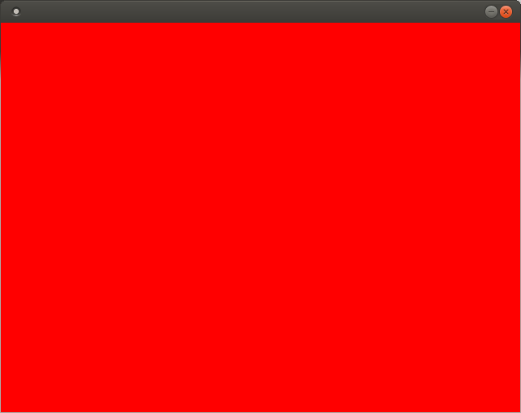

% 第1回:GUIの基礎の基礎ーウィンドウの表示をしよう!
% Glowlight
% 2018.03.14 

プログラミングは端末に文字列を表示させるだけではない. プログラミングをすることによりゲームだって作れるのだ. でもどうやって? ウィンドウや画像, 音楽を表示させる機能を使えばいい. 多くのプログラミング言語ではそのような ことをするのに追加でライブラリを入れるなど少し面倒な作業をしなければならない. でもJavaなら最初からそういう 機能が付属しているので大丈夫.

ただし, GUIを扱うプログラムは今までも文字列を扱う(CUI)ものと書き方が多少異なるので. そこは覚悟しなくてはならない. だけど, 簡単な例を通して実際にプログラムを作っていけば, GUI向けのJavaの書き方にすぐ慣れるだろう.

ということで, 今回はゲーム開発初回なので典型的な「ブロック崩しゲーム」を作っていこうと思う. 実は私はjavaでまともなゲームを作ったことはない. 他の言語ではあるけど. なのでこの記事を作りながら ゲーム作成法を学んでいこうと思う. この記事はゲーム開発日誌として読んで欲しい.

##方針

> ウィンドウを表示できるようになる.

というわけで，早速ソースコードを見てみよう! 今回はいきなり3つのソースファイルがあるけど, 短いから安心してくれたまえ.

##ソースコード

Main.java: ゲームを起動させるためのメインクラス
~~~java
public class Main{
    static public void main(String str[]){
        GameMain test = new GameMain();    
    }
}
~~~

GameMain.java: ゲームウィンドウを作るためのクラス ブラウザ本体のようなもの
~~~java
import java.awt.*;
import java.awt.event.*;
import javax.swing.*;
import javax.swing.event.*;
import java.io.*;

public class GameMain extends JFrame{
    private GameSequence sequence;
    public GameMain(){
        
        setDefaultCloseOperation(JFrame.EXIT_ON_CLOSE);
        setLocationRelativeTo(null);
        sequence = new GameSequence();
        add(sequence);
        pack();
        setResizable(false);
        setVisible(true);
    }
    public static void main(String str[]){
        new GameMain();        
    }
}
~~~

GameSequence.java: シーケンス(紙芝居の1シーン)のクラス ブラウザのタブみたいなもの
~~~java
import java.awt.*;
import java.awt.event.*;
import javax.swing.*;
import javax.swing.event.*;
import java.io.*;

//GameSystem
public class GameSequence extends JPanel{
    public GameSequence(){
        setPreferredSize(new Dimension(640, 480));
        setBackground(Color.BLACK);
    }
}
~~~

##解説

今回は3つのクラスを紹介する. 2つ目と3つ目は多分わけがわからないと思うが, GUIプログラミングをするための便利なおまじないだと思ってよい. プログラミング自体を初めたとき"HelloWorld!"プログラムを作った時のように.

最初のMain.javaはゲームを実行するためのクラスである. まず, この3つのソースファイルを同一のディレクトリに保存して以下のコマンドを入力してみよう!

~~~bash
java Main
~~~

すると, 黒い画面が出てくるはず.

 

この黒い画面を表示することがGUIプログラミングの小さいが大きな一歩なのである.

次に, GameSequnece.java内の

~~~java
setBackground(Color.BLACK);
~~~

の部分を

~~~java
setBackground(Color.RED);
~~~

に変えてみよう! これをコンパイルして実行すると革命的で力強いウィンドウが出てくるはずだ.

さらに,

~~~java
setPreferredSize(new Dimension(640\, 480));
~~~

の数値を変更するとウィンドウの大きさを変えることができる.こんな感じで自分でいろいろ書き換えてみて実験をすることはプログラミング上達の大切な試みなので是非是非積極的に実験してみて欲しい.
