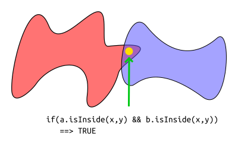
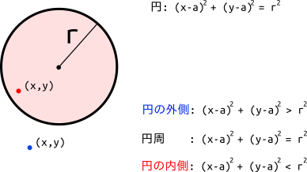

% 円同士の重なり
% Glowlight
% 2018.03.14

ゲーム作りで最初に直面する壁は当たり判定だろう. アクションゲームを作るならキャラとブロックの判定が無いとキャラは落ちてしまうし, 自分の攻撃と敵キャラの判定がなければ敵を倒すこともできない. アイテムに判定がなければ体力回復もできない. 当たり判定が実装されていなければ, ゲームとしてはとてもつまらないものになるのは明らかである. でもいざ自分で当たり判定を実装しようとしてもなかなか難しい. 幾何学・ベクトル・代数といった数学の知識, さらに, キャラとブロックの滑り,摩擦, 反射などを実装するには物理学の知識も必要になる.ゲームを作る上で, 画像を表示すること・文字を表示すること・場面転換などは, すこしプログラミングを知っていればすぐに出来るようになるが, 当たり判定は数学と物理学の知識がないとなかなか難しく, ゲーム作成の大きな壁の一つとなっている.

大きな壁でも, 簡単な問題から始めて少しずつ当たり判定に関する知識, 処理法を学んでいけばいずれは乗り越えられる. 考えられる流れとしては, 静止した物体が重なっているかどうかの判定 -> 動いている物体同士が次の瞬間に衝突するかどうかの判定 -> 物体のめり込み修正 となるだろう. さらにこれは図形の種類によっても難しさが変わる. 点 -> 円 -> 直線 -> 線分 -> 長方形 ... というように図形が複雑になるに連れて当たり判定は難しくなっていく. というわけで, 当たり判定の話は**静止している円同士が重なっているかどうか**という話が一番単純な話だろうから, これを最初に取り上げることにした.

結論から先に言うと, この場合は

**円A, Bの中心同士の距離 <= 円A, Bの半径の和)**となるとき, 円A,Bは重なりあうのである.

##そもそも図形同士が重なっているとかどういうことなのか

円同士が重なりあうということを考える前に, 図形が重なりあうとはどういうことなのかを考えて見る必要がありそうだ. ここで具体的に重なっている図形とそうでない図形を見てみよう.

左の緑の長方形は互いに重なっている. 中央の赤い円も互いに重なっている. しかし, 右の黄色い正三角形は互いに**重なってはいない**. これを数学的な言葉で記述すると次のようになる.

図形を集合をみなして, 図形に囲まれた領域にある点をその集合の要素と考える. つまり, ある点$x$と図形$A$に対して$x \in A$. こう考えると, ある図形$A, B$に対して, 図形$A$にも含まれていて図形$B$にも含まれているような点が存在するとき「図形$A$と図形$B$は重なっている」と言うことができる. 集合論の記号で書くと$A \cap B \neq ∅$ というわけだ.図形の面積を考えると分かりやすいかも知れない. 図形Aの面積をS(A)で表すとすると, 図形A,Bが重なっていないとき,

> $S(A+B) = S(A) + S(B)$

となり線形的な結果が得られる. 一方, 図形$A, B$が重なっているときは,

> $S(A+B) = S(A ∪ B) - S(A ∩ B) < S(A) + S(B)$

となっている.

この集合論の考えで当たり判定を実装するときは, 主人公の座標を$(x,y)$として, 当たりを調べたい図形を赤く塗る.主人公の位置の色を取得してそれが赤だったら主人公はその図形と衝突している. とできたりする.

あと, 複雑な図形A,Bがあり, ある点が図形A,Bに含まれているかどうかを簡単に判別できる関数 a.isInside(x, y), b.isInside(x, y) が実装されているとき, 画面上のあるドット$(x, y)$について

if( a.isInside(x, y) && b.isInside(x, y))

とすれば重なりが判定できたりする.

 

ここまで集合論の話をしていて何だが, 正直ここで話したことって円や四角形の衝突には役に立たないのだ.画面上の全ドットを探して衝突判定するなんで正直計算量が多なってしまう. もっと図形の幾何学的性質を使って賢く当たり判定を計算したほうがいいのだ.

## 円同士の当たり判定

円の定義は, **中心となる点からの距離が等しい点の集合**である. その"距離"のことを半径という. 点と中心点の距離が半径よりも小さいとその点は円の内部にあり, 等しいと円周上にあり, 大きいと円の外側にあることになる. この性質を円同士の当たり判定に応用する.

 

円A,Bが重なりあうのは左の絵のように,

> 円A, Bの中心同士の距離 <= 円A, Bの半径の和

となるときである. 逆に右の絵のように,

> 円A, Bの中心同士の距離 > 円A, Bの半径の和

となれば, 円A,Bは重なり合わない.

プログラムで書くと, 円Aの中心座標$(x_a, y_a)$, そして半径$r_a$, 円Bの中心座標$(x_b, y_b)$, そして半径$r_b$とすると,

> $(x_b - x_a)^2 + (y_b - y_a)^2 \leq (r_a + r_b)^2$

が円A,Bが重なりあう条件式となる. この条件を満たすとき, 円Aの内部に円Bに含まれる点が存在することになるので重なりあうのである.
