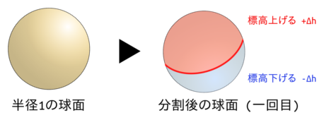
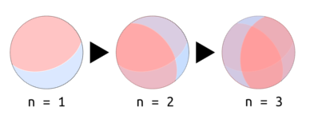
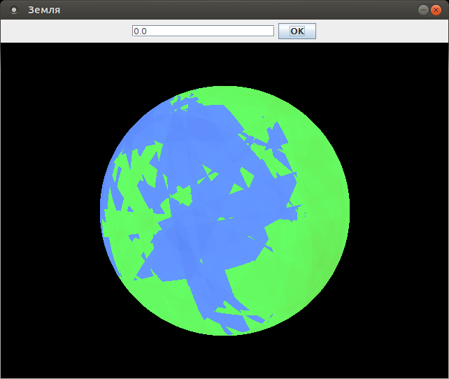

% 惑星を生成する その1 - Great Circle Faulting の導入
% Glowlight
% 2018.03.14

RPGをしているとそのゲーム世界の地図を見ることがあるだろう. 例えば, 道に迷って今どこにいるかわからなくなったら地図を見て周囲の地形から現在地を把握するとか, 物語の進行で次の街に行く必要が出たので地図をみてそこまでの道のりを調べるとか, もうクリアしたのでまだ行っていない場所に行ってみようということで地図を見て未知の場所を探すとか, いろいろな場面で地図を見る機会が出てくる.

ゲーム世界の地図を見ていると, ある違和感に気づくだろう. #B(なんかこの地形おかしくね?と言うやつだ. あれ? この世界, 東端に行ったら西端から出てくるし, 北端に行ったら南端からでてくるぞ! おいこれってドーナツじゃないか! この世界の形状ドーナツだぞ!! という定番のネタもあれば, この大陸の分布おかおかしくね? 海面が異常に少ないし, プレートの形状どうなってんの? って思わざるを得ないものもある.

これは個別のゲーム作品の話だけではなく, ネット上にあるゲーム作成用の地形生成ソフトについても言える. 球面に対応し大陸の分布もきちんとしているやつがなかなか見つからないのだ. ゲーム作成をしていると, 地形生成やマップ生成は楽しいのではあるがなかなか面倒くさい. 自動化したくなる. なので地形生成ソフト使って自動生成しようと思っても, 上記の通りの有様である.

ならば自分で作るしかないじゃないか! 私はそう決心した. いろんな生成アルゴリズムを試して, 何回も失敗を繰り返して納得の行く地形生成ソフトを作り上げてやろうではないか.

## 球面地形生成アルゴリズムの紹介: Great Circle Faulting

球面に対応していて, かつそれっぽい地形を作れる手法として**Great Circle Faulting **(GCF)を紹介しよう.

 

これは球面を大円で半分に分けて, 一方の高度を上げて, もう一方の高度を下げるという操作を何回も繰り返して地形を作り上げるという方法である. 上の図で言うと赤い線が大円であり, 球面上の円のうちで最も大きな円のことである. これを球面上にランダムに置くと, その大円を堺にして球を2つの領域に分けることが出来る. そして,赤い領域では標高を$+1$だけ増加させ, 青い領域では$-1$だけ減少させるという操作をする. これを$i, (0 \leq i \leq n)$回繰り返すと惑星の地形が出来上がる. $n$は多いほうが完成度が上がるが, その分重くなる. これがGCFの基本的な手法である.

 

この図だけを見ても本当にこれで地形が出来上がるのか疑問にと思うだろう. なので実際にGCFを用いて生成した惑星の例をここに貼る.
 
  

地球っぽくなっているのがわかるだろう. 分割数が少ないのでまだ三角形が目立っている. もっと分割数を多くすればもっと地球らしくなる.

次回で実際にこれを実装するアルゴリズムを紹介する予定である.
